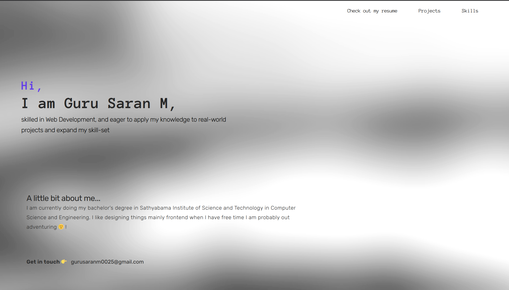

# [MY PORTFOLIO](https://portfolio-v1-635ea.web.app/)

This repo contains the code of my first portfolio website.

Well, what can I say, I'm pretty proud of myself for doing this.

## Technologies used

- **NEXT.js 14**
- **TailwindCSS**
- **Framer motion**
- **Flaticons**

I hosted my portfolio on firebase - [click here](https://portfolio-v1-635ea.web.app/)

## Images

